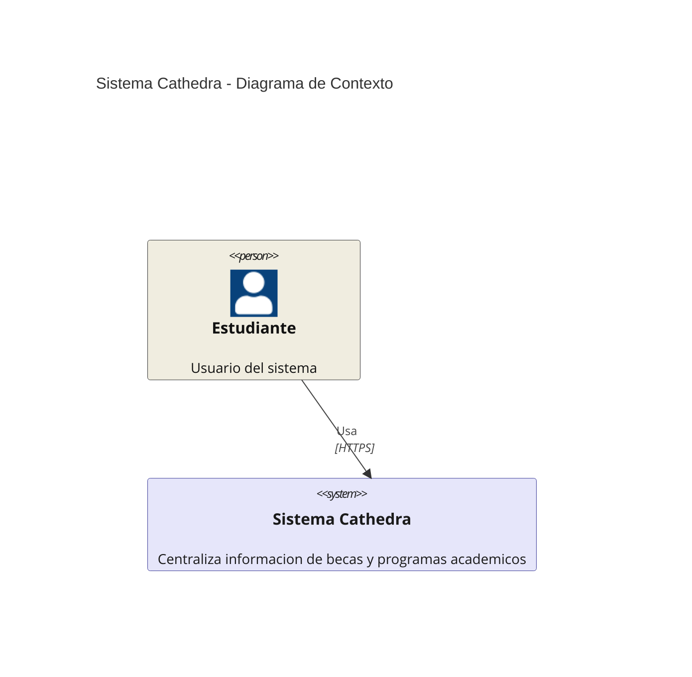
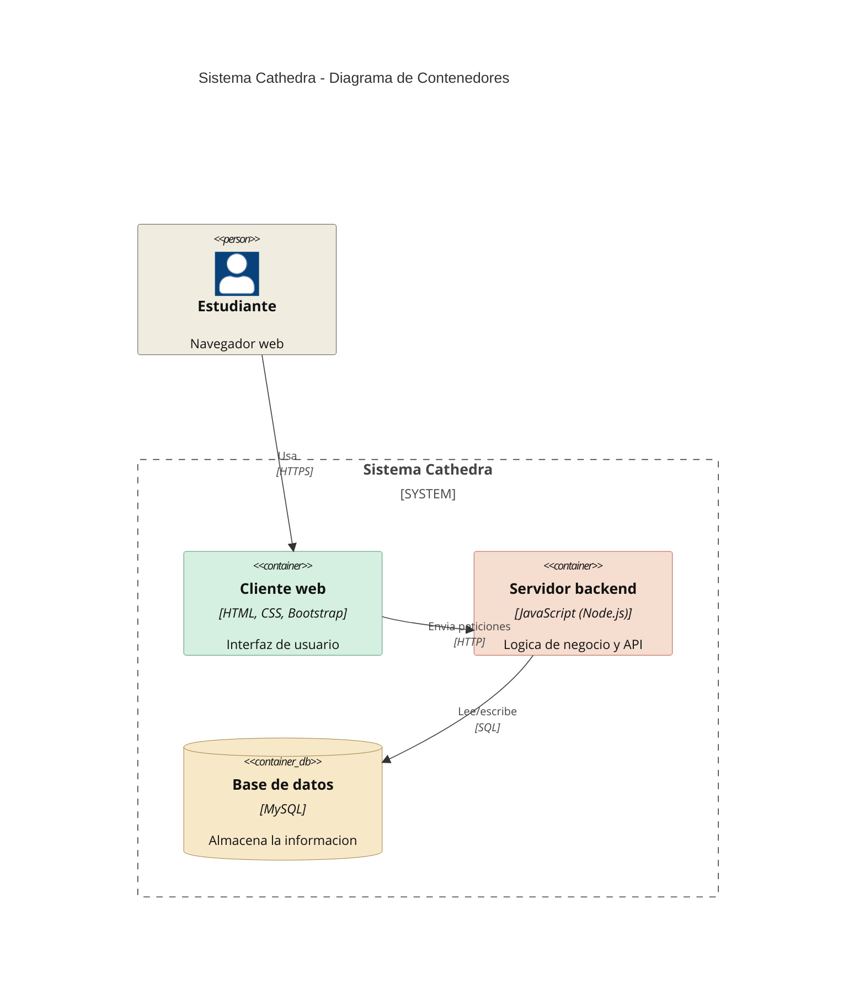

## 1. Arquitectura propuesta

La arquitectura de Cathedra se define utilizando el estandar C4, cubriendo los niveles 1 (Contexto) y 2 (Contenedores). El nivel de contexto muestra al estudiante como unico actor externo que interactua con el sistema. El nivel de contenedores desglosa el sistema en sus tres componentes principales: el cliente web, el servidor backend y la base de datos, indicando la tecnologia usada en cada capa y el protocolo de comunicacion entre ellas.
## Nivel 1 — Diagrama de contexto

## Nivel 2 — Diagrama de contenedores

*Figura 1. Diagrama de arquitectura C4 (niveles 1 y 2), fuente propia Cathedra.*

## 1.1. Componentes identificados

- Cliente (frontend): interfaz con la que interactua el estudiante desde su navegador web.

- Servidor (backend): procesa las peticiones, aplica la logica de negocio y se comunica con la base de datos.

- Base de datos: almacena la informacion de usuarios, universidades, becas y programas academicos.

## 1.2. Tecnologias planeadas por capa

| Capa | Tecnologia | Funcion principal |
| --- | --- | --- |
| Cliente (frontend) | HTML5, CSS3, Bootstrap | Estructura, estilo y diseno responsivo de la interfaz que usa el estudiante. |
| Servidor (backend) | JavaScript (Node.js) | Procesa peticiones, aplica la logica de negocio (busquedas, validaciones, gestion de usuarios) y se comunica con la base de datos. |
| Base de datos | MySQL | Almacena la informacion de usuarios, universidades, becas y programas academicos. |

## 1.3. Comunicacion entre capas

- Cliente <-> Servidor: protocolo HTTP/HTTPS, garantizando el cifrado de la informacion transmitida.

- Servidor <-> Base de datos: consultas SQL mediante un driver u ORM de Node.js compatible con MySQL (por ejemplo, mysql2 o Sequelize).